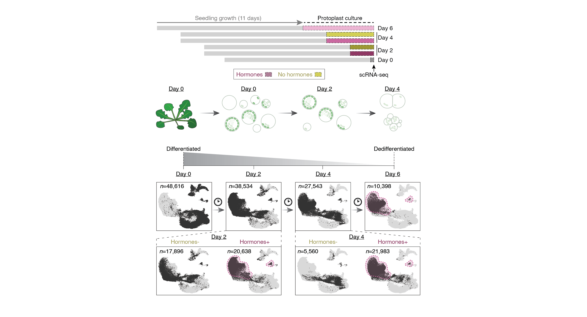

# Arabidopsis Protoplast Temporal Dedifferentiation and Phytohormone Perturbation scRNAseq Atlas

 (v1.0.0)

This repository contains scripts used in the analysis of the protoplast scRNA-seq data across a timecourse and perturbation experiment. If you use any of the scripts or data associated with this study, please consider citing our work:

> Fabio Gomez-Cano*, Luguang Jiang*, Yoonjin Cho, Mariel Cruz-Gomez, Kook Hui Ryu, Kelsey Reed, Rachel Rivero, Lane Vitek, Bastiaan A. Bargmann, Alexandre P. Marand (2026).
> [**Cell-specific dedifferentiation in Arabidopsis thaliana**](https://doi.org/10.64898/2026.05.21.726904)
> [**bioRxiv**](https://doi.org/10.64898/2026.05.21.726904), doi: 10.64898/2026.05.21.726904

## Links to raw and processed data can be found below

